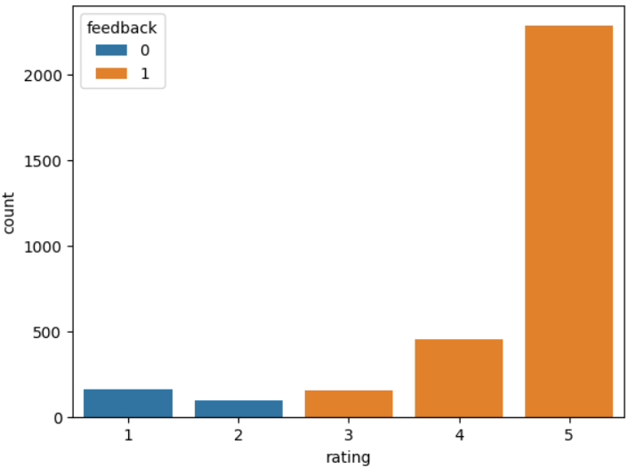
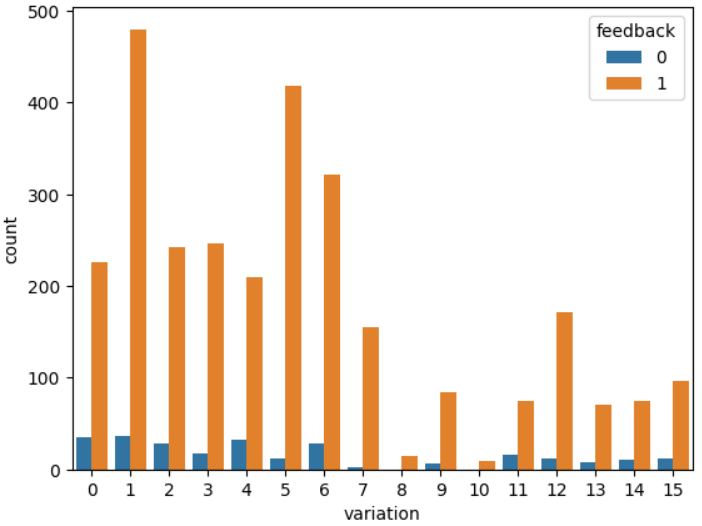
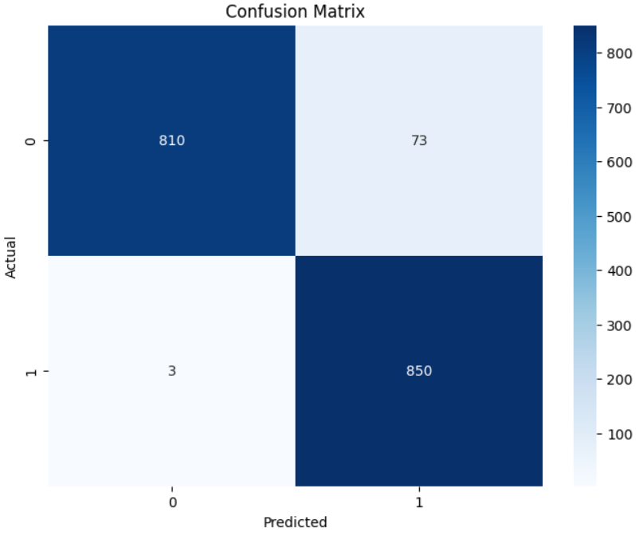
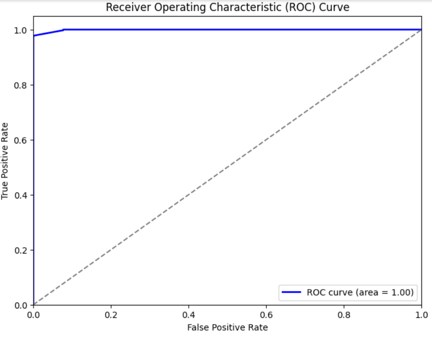
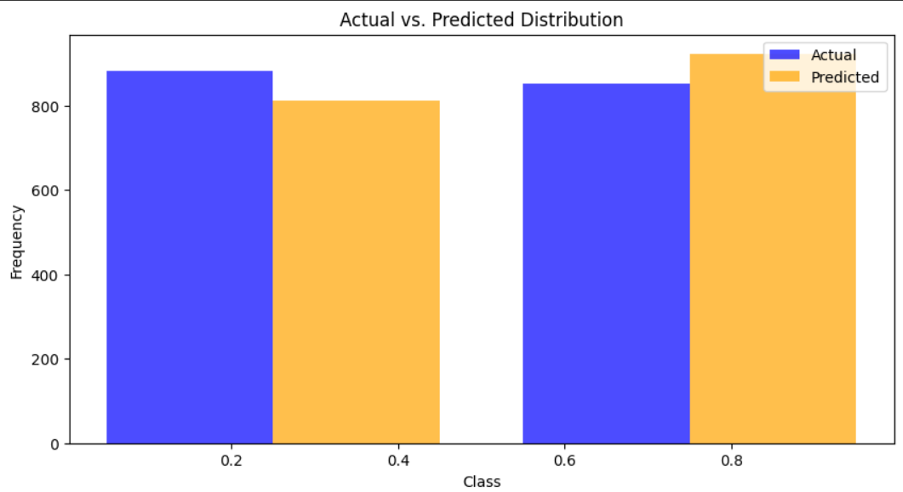
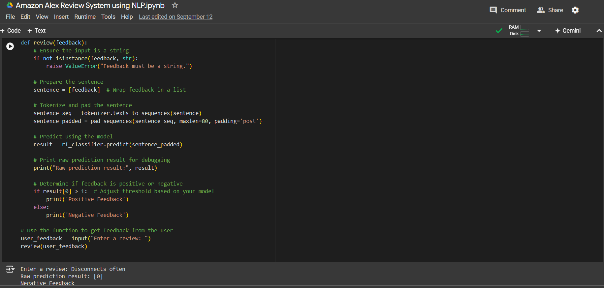

# Amazon Alexa Feedback Classifier

This project focuses on building a classification model to predict whether feedback for Amazon Alexa is positive or negative based on verified customer reviews. The project uses natural language processing techniques, including tokenization, text padding, and handling class imbalance, and evaluates the model with various metrics.

## Project Title: **Amazon Alexa Sentiment Analysis: An NLP Approach to Feedback Classification**

### Objective:
- Analyze customer reviews for Amazon Alexa.
- Preprocess the review text data.
- Train a machine learning model to classify feedback (positive or negative).
- Use visualizations to explore and understand the data and model performance.

# Amazon Alexa Review System using NLP

This project focuses on analyzing and classifying Amazon Alexa reviews using Natural Language Processing (NLP) techniques. The Jupyter Notebook includes both exploratory data analysis (EDA) and the machine learning pipeline for training a sentiment classifier.

## Installation and Setup

1. Clone the repository:
    ```bash
    git clone https://github.com/nitheesh2509/Amazon-Alexa-Sentiment-Analysis-An-NLP-Approach-to-Feedback-Classification.git
    ```

2. Navigate into the project directory:
    ```bash
    cd Amazon-Alexa-Sentiment-Analysis-An-NLP-Approach-to-Feedback-Classification
    ```

3. Install the required dependencies:
    ```bash
    pip install -r requirements.txt
    ```

4. Explore the notebook:
    - **`Amazon_Alex_Review_System_using_NLP.ipynb`**: Contains the complete analysis and model training process, including:
      - Exploratory data analysis (EDA)
      - Text preprocessing
      - Handling class imbalance with SMOTETomek
      - Model training and evaluation

5. Outputs can be viewed directly via the provided screenshots if needed.

## Requirements

- Python 3.x
- Jupyter Notebook
- NumPy
- Pandas
- Seaborn
- Matplotlib
- Scikit-learn
- TensorFlow
- imbalanced-learn (for SMOTETomek)

## How to Use

1. Open the Jupyter notebook (`Amazon_Alex_Review_System_using_NLP.ipynb`) in your preferred environment.
2. Run the cells step-by-step to:
    - Analyze the dataset using EDA techniques.
    - Preprocess the reviews for machine learning.
    - Apply SMOTETomek to balance the dataset.
    - Train and evaluate the sentiment classifier.

## Key Components:

1. **Exploratory Data Analysis (EDA):**
   - Conducted to understand the distribution of the dataset, key patterns, and relationships between variables.
   - Visualizations include the rating distribution, feedback count, and variation distribution.

   **Screenshots of EDA:**
   - 
   - 

2. **Model Training:**
   - The dataset is balanced using SMOTETomek to handle class imbalance.
   - Tokenization and text preprocessing were applied to transform the `verified_reviews` text into sequences.
   - A Random Forest Classifier was trained on the preprocessed data.

   **Screenshots of Model Outputs:**
   - 
   - 
   - 
   - 